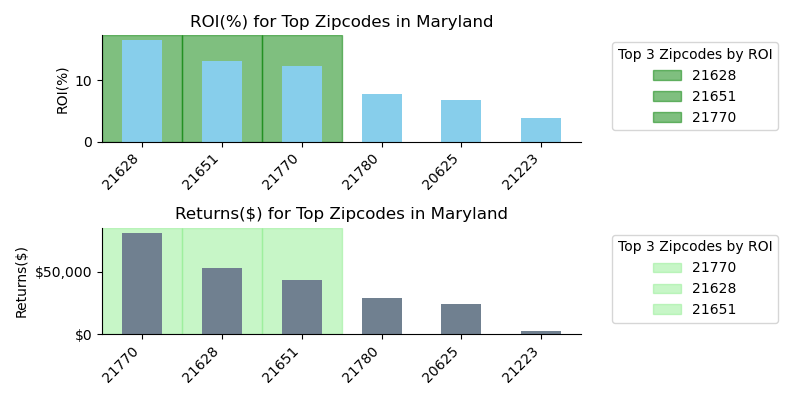

# Forecasting Top Zipcodes for Real Estate Investment - Baltimore-Washington Area

## Introduction
This project utilized advanced data science techniques to identify the top three zip codes in the Baltimore-Washington area, offering the highest potential return on investment (ROI) over a three-year horizon. Using the CRISP-DM methodology ensured a structured and thorough approach, providing reliable insights for potential real estate investors.

## Data Collection and Preparation
The analysis was based on Zillow's zipcode-level time series data.

- We first selected zipcodes that were both:
    - Located in the state of MD.
    - Located in the metro area for either Baltimore or Washington, DC.

- From these selected zipcodes, we analyzed the % increase in home value over the last 5 years were selected.
    - The the top 10 zipcodes that had the highest percent increase were selected.
    - Of these top 10 zipcodes, we decided to eliminate any zipcodes  with an investment cost less than \$1 Million.

## Modeling and Evaluation

Time series SARIMAX models were fit for each of the final zipcodes, using a test period of 24 months, to allow for accurate forecasting 24 months into the future. 
The models were optimized for parameters using cross-validation techniques and their performance was assessed through metrics such as RMSE, MAE, and MAPE.

## Key Findings and Recommendations

1. **21628**: Highest predicted ROI with significant development projects underway, enhancing future property values.

2. **21651**: Demonstrated consistent upward trends in home values, supported by strong economic indicators.
3. **21770**: Offers a balanced investment opportunity with potential for rental and resale gains due to its proximity to major employment hubs.

### Top Investment Zipcodes (by ROI):

#### Zipcode: 21628

##### Model Evaluation

[i] Evaluation Metrics:
- MAE: 25,890.03
- RMSE: 27,314.25
- MAPE(%): 8.94

> Model was off by $25K, on average.
> Mean Percentage Error is <10%, indicating an accurate forecast.

##### Forecasted Future Returns

[i] Investment Cost and Returns:
- Rank: 1
- Investment Cost: $320,023.99
- Forecasted Price: $372,842.65
- Returns: $52,818.67
- ROI(%): 16.50

#### Zipcode: 21651

##### Model Evaluation

[i] Evaluation Metrics:
- MAE: 33,990.84
- RMSE: 36,486.00
- MAPE(%): 10.88

##### Forecasted Future Returns

[i] Investment Cost and Returns:
- Rank: 2
- Investment Cost: $330,631.53
- Forecasted Price: $374,063.51
- Returns: $43,431.98
- ROI(%): 13.14

#### Zipcode: 21770

##### Model Evaluation

[i] Evaluation Metrics:
- MAE: 50,307.14
- RMSE: 54,112.09
- MAPE(%): 7.96

##### Forecasted Future Returns

[i] Investment Cost and Returns:
- Rank: 3
- Investment Cost: $658,041.27
- Forecasted Price: $739,425.39
- Returns: $81,384.12
- ROI(%): 12.37

### Insights:
- The selected zip codes have shown resilience in economic downturns and have robust growth projections based on predictive modeling.
- Investments in these areas are likely to benefit from both short-term gains and long-term appreciation.

## Conclusion
The use of sophisticated data modeling techniques has allowed for an accurate forecast of the real estate market in the Baltimore-Washington area, identifying zip codes that are likely to provide the best ROI. Investors are encouraged to consider these areas for their real estate investment portfolios.

## Further Actions
To maintain the relevance of the findings, it is recommended to update the models bi-annually with new data releases from Zillow and other economic indicators to capture the latest market dynamics.
