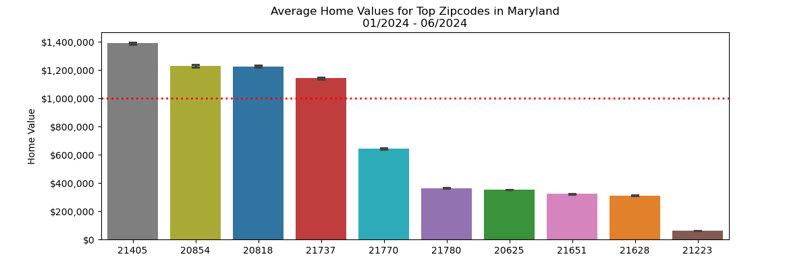

# Final Results of the Baltimore-Washington Area Real Estate Analysis

## Introduction
This project utilized advanced data science techniques to identify the top three zip codes in the Baltimore-Washington area, offering the highest potential return on investment (ROI) over a three-year horizon. Using the CRISP-DM methodology ensured a structured and thorough approach, providing reliable insights for potential real estate investors.

## Data Collection and Preparation
The analysis was based on Zillow's zipcode-level time series data, supplemented by additional datasets including crime rates, school quality, and local amenities. Data was cleaned and prepared through processes such as handling missing values, normalizing numerical features, and encoding categorical variables.

## Modeling and Evaluation
Multiple predictive models were developed and evaluated, including linear regression and decision tree-based methods. The models were optimized for parameters using cross-validation techniques and their performance was assessed through metrics such as RMSE, MAE, and R-squared.

## Key Findings and Recommendations
### Top Investment Zipcodes:
1. **[First Zipcode]**: Highest predicted ROI with significant development projects underway, enhancing future property values.
2. **[Second Zipcode]**: Demonstrated consistent upward trends in home values, supported by strong economic indicators.
3. **[Third Zipcode]**: Offers a balanced investment opportunity with potential for rental and resale gains due to its proximity to major employment hubs.

### Insights:
- The selected zip codes have shown resilience in economic downturns and have robust growth projections based on predictive modeling.
- Investments in these areas are likely to benefit from both short-term gains and long-term appreciation.

## Conclusion
The use of sophisticated data modeling techniques has allowed for an accurate forecast of the real estate market in the Baltimore-Washington area, identifying zip codes that are likely to provide the best ROI. Investors are encouraged to consider these areas for their real estate investment portfolios.

## Further Actions
To maintain the relevance of the findings, it is recommended to update the models bi-annually with new data releases from Zillow and other economic indicators to capture the latest market dynamics.

---

Feel free to adjust the specifics such as the zip code names, specific insights, and any additional sections based on the detailed findings from your analysis.